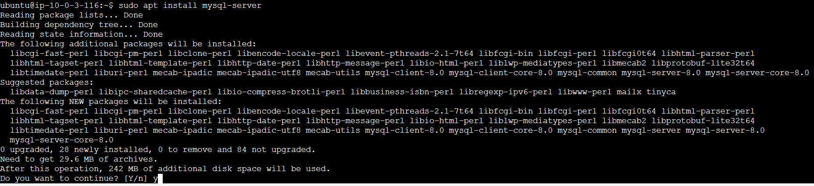
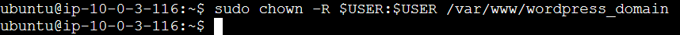

# Lab-How-to-Install-WordPress-with-LEMP-on-Ubuntu

- How To Install Linux, Nginx, MySQL, PHP (LEMP stack) on Ubuntu

### Step 1 - Create Ubuntu EC2 ###

- I will not show this step. Please set up in AWS Account.
After EC2 creation finished like this, you can proceed the following steps.


### Step 2 - Install the Nginx Web Server

- Click `Connect` by selecting EC2 Server


- Click `Connect`


- Type in terminal and enter

```
sudo apt update
``` 


- Type in terminal and enter

```
sudo apt install nginx -y
```


- Type in terminal and enter

```
sudo ufw app list
```


- Type in terminal and enter

```
sudo ufw allow 'Nginx HTTP'
```


- Type in terminal and enter

```
sudo ufw status
```


- Type in terminal and enter and Type ```y```

```
sudo ufw enable
```


- Type in terminal and enter

```
sudo ufw status
```


- Type in terminal and enter 

```
ip addr show
```


- Type in terminal and enter

 ```
 hostname -I
 ```


- Write IP address of EC2 in web browser 


- Will see Nginx Page like this  


- Type in terminal and enter

```
sudo systemctl enable nginx
```

- Type in terminal and enter

```
sudo systemctl start nginx
```

### Step 3 - Install MySQL

- Type in terminal and enter and type ```y```

```
sudo apt install mysql-server
```




- Type in terminal and enter and type ```y```

```
sudo mysql_secure_installation
```


- Type `1` and enter


- Type `n` and enter


- Type `n` and enter


- Type `n` and enter


- Type `y` and enter


- Type in terminal and enter

```
sudo mysql
```


- Type in terminal and enter

```
exit
```


### Step 4 - Install PHP

- Type in terminal and enter

```
sudo apt update
sudo apt install software-properties-common
sudo add-apt-repository ppa:ondrej/php
```

-Type in terminal and enter and Type ```y``` and enter

```
sudo apt install php-fpm php-mysql
```


### Step 5 - Configure Nginx to Use the PHP Processor

- Type in terminal and enter

```
sudo mkdir /var/www/wordpress_domain
```


- Type in terminal and enter

```
sudo chown -R $USER:$USER /var/www/wordpress_domain
```


- Type in terminal and enter

```
sudo nano /etc/nginx/sites-available/wordpress_domain
```

- Fill the following information and save the file. Update with EC2 Public IP.

```                                                        
server {
    listen 80;
    server_name 13.250.99.40;
    root /var/www/wordpress_domain;

    index index.html index.htm index.php;

    location / {
        try_files $uri $uri/ =404;
    }

    location ~ \.php$ {
        include snippets/fastcgi-php.conf;
        fastcgi_pass unix:/var/run/php/php8.3-fpm.sock;
     }

    location ~ /\.ht {
        deny all;
    }

}

```


- Type in terminal and enter 

```
sudo ln -s /etc/nginx/sites-available/wordpress_domain /etc/nginx/sites-enabled/
```


- Type in terminal and enter

```
sudo unlink /etc/nginx/sites-enabled/default
```


- Note: If you ever need to restore the default configuration, you can do so by recreating the symbolic link, like the following:

```
sudo ln -s /etc/nginx/sites-available/default /etc/nginx/sites-enabled/
```

- Type in terminal and enter

```
sudo nginx -t
```


- Type in terminal and enter 

```
sudo systemctl reload nginx
```


- Type in terminal and enter

```
vim /var/www/wordpress_domain/index.html
```

- Fill the following information and save the file

```
<html>
  <head>
    <title>Wordpress Website</title>
  </head>
  <body>
    <h1>Hello World!</h1>

    <p>This is the landing page of <strong>Wordpress Website</strong>.</p>
  </body>
</html>
```


- Write IP address of EC2 in web browser 


### Step 6 - Test PHP with Nginx

- Type and enter

```
vim /var/www/wordpress_domain/info.php
```


- Fill the following information and save the file

```                                                       
<?php
phpinfo();
```


- Write IP address of EC2 in web browser and update link like this 

```
http://13.250.99.40/info.php
```


- Type to remove

```
sudo rm /var/www/wordpress_domain/info.php
```

### Step 7 - Create a MySQL Database and User for WordPress

- Type in terminal and enter

```
sudo mysql
```


- Type in terminal and enter

```
CREATE DATABASE example_database;
```


- Type in terminal and enter

```
CREATE USER 'example_user'@'%' IDENTIFIED WITH mysql_native_password BY 'P@ssword123';
```


- Type in terminal and enter

```
GRANT ALL ON example_database.* TO 'example_user'@'%';
```


- Type in terminal and enter

```
exit
```


- Type in terminal and enter

```
mysql -u example_user -p
```


- Type in terminal and enter

```
SHOW DATABASES;
```


- Type in terminal and enter

```
exit
```


### Step 8 - Install Additional PHP Extensions

- Type in terminal and enter

```
sudo apt update
```


- Type in terminal and enter ```y``` and enter

```
sudo apt install php-curl php-gd php-intl php-mbstring php-soap php-xml php-xmlrpc php-zip
```


- Type in terminal and enter

```
sudo systemctl restart php8.3-fpm
```

- Type in terminal and enter

```
sudo systemctl enable php8.3-fpm
```

- Type in terminal and enter

```
sudo systemctl start php8.3-fpm
```


- Type in terminal and enter

```
sudo vim /etc/nginx/sites-available/wordpress
```


- Fill the following information and save the file


```
server {
    . . .

    location = /favicon.ico { log_not_found off; access_log off; }
    location = /robots.txt { log_not_found off; access_log off; allow all; }
    location ~* \.(css|gif|ico|jpeg|jpg|js|png)$ {
        expires max;
        log_not_found off;
    }
    . . .
}
```


- Type in terminal and enter


```
sudo nginx -t
```


- Type in terminal and enter

```
sudo systemctl reload nginx
```


### Step 9 - Download WordPress

- Type in terminal and enter

```
cd /tmp
```


- Type in terminal and enter

```
curl -LO https://wordpress.org/latest.tar.gz
```


- Type in terminal and enter

```
tar xzvf latest.tar.gz
```


- Type in terminal and enter 

```
cp /tmp/wordpress/wp-config-sample.php /tmp/wordpress/wp-config.php
```


- Type in terminal and enter

```
sudo cp -a /tmp/wordpress/. /var/www/wordpress_domain/wordpress
```


- Type in terminal and enter

```
sudo chown -R www-data:www-data /var/www/wordpress_domain/wordpress
```


### Step 10 - Set up the WordPress Configuration File

- Type in terminal and enter

```
curl -s https://api.wordpress.org/secret-key/1.1/salt/
```


- Copy these information to notepad 

```
define('AUTH_KEY',         '+9J=c/h^w)q}Ef9IG40XD|gl6=P[Qej1MQd*|T}S+GUZ?(-DiQdd:kO5gk-3 |0G');
define('SECURE_AUTH_KEY',  'GD=yYxIfNs$h?O1;:VS}_|&jkG,_]bo#u]%2s}:vlVI.)%]P6!n<gnG*,_&*UGga');
define('LOGGED_IN_KEY',    'y3*Qk3+~6u{t|gVx>G*R->^>=Ad0ANuabGb0mqFtzS+abfuqJXP&j0x%]N<C?[]?');
define('NONCE_KEY',        '><7-<SrclrV8:vgJ(nwV0P34qs^]|2CGllbnh:v7&AK-(-ip+3rwP]p4|muB5Jd_');
define('AUTH_SALT',        'NOGza*IZb(-*sL?:j:y:VJx^FsmuF*jlQXci&.Rvp6m`73`m1p_^g[o(?|VY38)`');
define('SECURE_AUTH_SALT', '(PUl}fDkAZ)XT.+0?r,KZ:YGy#*2=J=9n!k:tsZzs;-wpC/<&!}|({isz;e%de3+');
define('LOGGED_IN_SALT',   'YqrY4v6q[3-PP5AX&#d&wG;X^^,jFX?[BRsxgV?eNe47yH3(S#-1cpsqZO>7-hh2');
define('NONCE_SALT',       '`Y!l-txV:0>-Xh#<|{n8!Zr*6>|{}r.-|pW#TPVR@mh8tA0!H>n&fF=0z~c!l|Yq');
```

- Type in terminal and enter

```
sudo vim /var/www/wordpress_domain/wordpress/wp-config.php
```


- Update these information with the information in notepad


- Update these information with you created earlier and save file


### Step 11- Complete the Installation Through the Web Interface

- Type in terminal and enter and click `Continue`

```
http://13.250.99.40/wordpress/wp-admin/install.php
```


- Fill the information and click `Install Wordpress`


- Click `Log In`


- Fill the information and Click `Log In`


-  You will see WordPress administration dashboard


---

***Congratulations, you have completed Lab - How To Install Wordpress with LEMP on Ubuntu***

---


